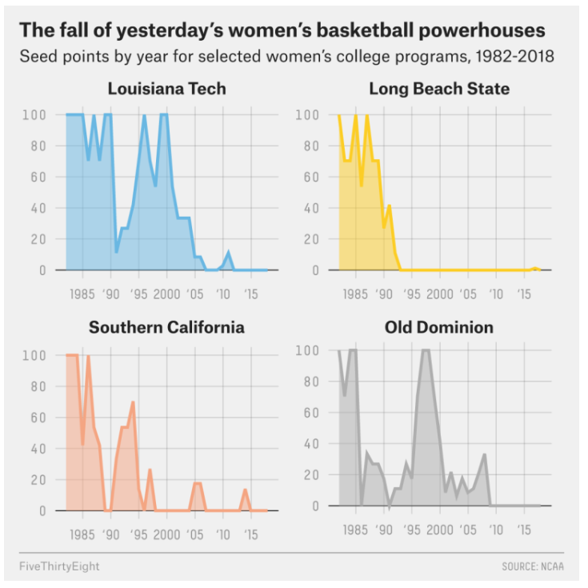

# PLOT
## Prompt 1
I want to recreate the 'Fall of yesterday’s women’s basketball powerhouses' chart from FiveThirtyEight using ggplot2 in R. It should have columns: year (1982-2018), school (Louisiana Tech, Long Beach State, Southern California, Old Dominion), and seed_points (0-100).

### Edition 1
```{r, warning=FALSE}
# 0) Load required packages
library(tidyverse)
library(ggplot2)
library(here)
# 1) Read the FiveThirtyEight/NCAA tournament history dataset
raw <- readr::read_csv(
  here("presentation-exercise", "ncaa-womens-basketball-tournament-history.csv"),
  show_col_types = FALSE
)

# 2) Keep only the four programs shown in the original figure
#    (Note: in the dataset, Long Beach State is labeled as "Long Beach St.")
schools_keep <- c(
  "Louisiana Tech",
  "Long Beach St.",
  "Southern California",
  "Old Dominion"
)

# 3) Build the plotting dataset with the required columns:
#    year (1982–2018), school, seed_points (0–100)
plot_df <- raw %>%
  # Limit to the target time window and selected schools
  filter(Year >= 1982, Year <= 2018, School %in% schools_keep) %>%
  # Keep only what we need and standardize names
  transmute(
    year   = Year,
    school = School,
    seed   = as.numeric(Seed)
  ) %>%
  # Convert NCAA seed (1 is best, 16 is worst) into a 0–100 "seed points" scale
  # Higher seed_points = better seed / stronger tournament position
  mutate(seed_points = (17 - seed) / 16 * 100) %>%
  select(year, school, seed_points) %>%
  # Fill in missing years for each school (years without a tournament appearance)
  # so the line/area sits at 0, matching the look of the FiveThirtyEight figure.
  complete(
    year = 1982:2018,
    school = schools_keep,
    fill = list(seed_points = 0)
  ) %>%
  # Clean up the displayed school name and set facet order
  mutate(
    school = recode(school, "Long Beach St." = "Long Beach State"),
    school = factor(
      school,
      levels = c(
        "Louisiana Tech",
        "Long Beach State",
        "Southern California",
        "Old Dominion"
      )
    )
  )

# 4) Colors chosen to resemble the original FiveThirtyEight palette
cols <- c(
  "Louisiana Tech"      = "#4FA3D9",
  "Long Beach State"    = "#F2C230",
  "Southern California" = "#F28C6B",
  "Old Dominion"        = "#9E9E9E"
)

# 5) Recreate the chart: area + line, faceted into a 2x2 grid
p <- ggplot(plot_df, aes(x = year, y = seed_points, color = school, fill = school)) +
  # Lightly filled area under the line
  geom_area(alpha = 0.35, linewidth = 0) +
  # Outline line on top of the area
  geom_line(linewidth = 1.2) +
  # Four small multiples (2 columns -> 2x2 layout)
  facet_wrap(~ school, ncol = 2) +
  # Apply manual colors for both line and fill
  scale_color_manual(values = cols) +
  scale_fill_manual(values = cols) +
  # Match the 0–100 y-axis scale and tick spacing
  scale_y_continuous(limits = c(0, 100), breaks = seq(0, 100, 20)) +
  # Match the x-axis labeling style (with abbreviated years)
  scale_x_continuous(
    breaks = c(1985, 1990, 1995, 2000, 2005, 2010, 2015),
    labels = c("1985", "'90", "'95", "2000", "'05", "'10", "'15")
  ) +
  # Titles and source caption
  labs(
    title = "The fall of yesterday’s women’s basketball powerhouses",
    subtitle = "Seed points by year for selected women’s college programs, 1982–2018",
    caption = "SOURCE: NCAA",
    x = NULL,
    y = NULL
  ) +
  # FiveThirtyEight-style minimal look
  theme_minimal(base_size = 12) +
  theme(
    legend.position = "none",
    panel.grid.minor = element_blank(),
    panel.grid.major = element_line(color = "#D9D9D9", linewidth = 0.6),
    strip.text = element_text(face = "bold", size = 12),
    plot.title = element_text(face = "bold", size = 16),
    plot.subtitle = element_text(color = "#4D4D4D"),
    plot.caption = element_text(color = "#8C8C8C"),
    axis.text = element_text(color = "#8C8C8C")
  )
p
```

## Prompt 2 
By comparing the two graphs, I noticed that there seemed to be an issue with the calculation of seed. So, I returned to the website and found the description of the seed calculation, and then I informed the AI.
Prompt: 
Please look at the picture I generated. There is a problem with the seed calculation. Please calculate according to the following rules: *Seed points award a score on a 100-point scale; a No. 1 seed gets 100 points, while the rest descend in proportion to the seed’s expected wins during the tournament*.And also add x- and y-axis  labels to all of pictures for me.
```{r, warning=FALSE}
library(tidyverse)

raw <- readr::read_csv(
  here("presentation-exercise", "ncaa-womens-basketball-tournament-history.csv"),
  show_col_types = FALSE
)
# 1) Build a seed -> expected wins lookup (1982–2018)
seed_lookup <- raw %>%
  filter(Year >= 1982, Year <= 2018) %>%
  transmute(
    seed = as.numeric(Seed),
    tourney_w = as.numeric(`Tourney W`)
  ) %>%
  filter(!is.na(seed), !is.na(tourney_w)) %>%
  group_by(seed) %>%
  summarise(exp_wins = mean(tourney_w), .groups = "drop") %>%
  mutate(seed_points = exp_wins / exp_wins[seed == 1] * 100) %>%
  select(seed, seed_points)

# 2) Schools to plot
schools_keep <- c("Louisiana Tech", "Long Beach St.", "Southern California", "Old Dominion")

# 3) Create year/school/seed_points and fill missing years with 0
plot_df <- raw %>%
  filter(Year >= 1982, Year <= 2018, School %in% schools_keep) %>%
  transmute(
    year = Year,
    school = School,
    seed = as.numeric(Seed)
  ) %>%
  left_join(seed_lookup, by = "seed") %>%
  select(year, school, seed_points) %>%
  complete(
    year = 1982:2018,
    school = schools_keep,
    fill = list(seed_points = 0)
  ) %>%
  mutate(
    school = recode(school, "Long Beach St." = "Long Beach State"),
    school = factor(
      school,
      levels = c("Louisiana Tech", "Long Beach State", "Southern California", "Old Dominion")
    )
  )

# 4) Plot (same styling idea as before)
cols <- c(
  "Louisiana Tech"      = "#4FA3D9",
  "Long Beach State"    = "#F2C230",
  "Southern California" = "#F28C6B",
  "Old Dominion"        = "#9E9E9E"
)

ggplot(plot_df, aes(x = year, y = seed_points, color = school, fill = school)) +
  geom_area(alpha = 0.35, linewidth = 0) +
  geom_line(linewidth = 1.2) +
  facet_wrap(~ school, ncol = 2, scales = "free") +
  scale_color_manual(values = cols) +
  scale_fill_manual(values = cols) +
  scale_y_continuous(limits = c(0, 100), breaks = seq(0, 100, 20)) +
  scale_x_continuous(
    breaks = c(1985, 1990, 1995, 2000, 2005, 2010, 2015),
    labels = c("1985", "'90", "'95", "2000", "'05", "'10", "'15")
  ) +
  labs(
    title = "The fall of yesterday’s women’s basketball powerhouses",
    subtitle = "Seed points by year for selected women’s college programs, 1982–2018",
    caption = "SOURCE: NCAA",
    x = NULL, y = NULL
  ) +
  theme_minimal(base_size = 12) +
  theme(
    legend.position = "none",
    panel.grid.minor = element_blank(),
    panel.grid.major = element_line(color = "#D9D9D9", linewidth = 0.6),
    strip.text = element_text(face = "bold", size = 12),
    plot.title = element_text(face = "bold", size = 16),
    plot.subtitle = element_text(color = "#4D4D4D"),
    plot.caption = element_text(color = "#8C8C8C"),
    axis.text = element_text(color = "#8C8C8C")
  )

ggsave(
  filename = "Generated-graph.png",
  plot = last_plot(),
  width = 8,
  height = 6,
  dpi = 300,
  bg = "#F0F0F0" # Match the FiveThirtyEight background color
)
```

### Original Graph
{width=100%}


# TABLE
## Prompt
Write R code to create a professional summary table from the NCAA basketball dataset that includes automatically calculated statistics, bold text, conditional color formatting, a spanner header, a footnote, a caption, and inline sparklines.
```{r, waring = FALSE}
# Load table formatting packages
library(gt)
library(gtExtras)

# 1) Process data: Calculate summary statistics for the top 5 schools (by total wins)
# and create a list column of their historical win trends for the sparkline.
top_schools_summary <- raw %>%
  # Filter for recent history to make sparklines legible (e.g., 2000 onwards)
  filter(Year >= 2000) %>%
  mutate(
    tourney_w = as.numeric(`Tourney W`),
    seed = as.numeric(Seed)
  ) %>%
  # Remove NA rows that might break calculations
  filter(!is.na(tourney_w), !is.na(seed)) %>%
  group_by(School) %>%
  summarize(
    Appearances = n(),
    Total_Wins = sum(tourney_w),
    Avg_Wins_per_Tourney = Total_Wins / Appearances,
    Avg_Seed = mean(seed),
    # Create a list of wins ordered by year for the sparkline
    Wins_History = list(tourney_w[order(Year)]),
    .groups = "drop"
  ) %>%
  # Keep only the top 5 schools with the most wins since 2000
  slice_max(order_by = Total_Wins, n = 5)
top_schools_summary <- top_schools_summary %>%
  mutate(School = stringr::str_replace_all(School, " ", "\u00A0"))

# 2) Build the gt table
top_schools_table <- top_schools_summary %>%
  gt() %>%
  
  # A descriptive caption/title explaining the summary
  tab_header(
    title = md("**Modern Era Dominance: Top 5 NCAA Women's Programs**"),
    subtitle = "Tournament performance summary (2000–2018)"
  ) %>%
  tab_caption(
    "Caption: This table summarizes 2000–2018 NCAA tournament performance for the top five women’s programs by total wins. Higher W/App indicates more wins per appearance, while lower Avg Seed indicates stronger seeding; sparklines show wins by year."
  ) %>%
  # Spanning column header
  tab_spanner(
    label = "Historical Performance Metrics",
    columns = c(Total_Wins, Avg_Seed, Wins_History)
  ) %>%
  
  # Formatted text: Bold the school names
  tab_style(
    style = cell_text(weight = "bold"),
    locations = cells_body(columns = School)
  ) %>%
  
  # Conditional formatting: Color the average seed
  # Green is better (lower number), Red is worse (higher number)
  data_color(
    columns = Avg_Seed,
    colors = scales::col_numeric(
      palette = c("#1a9850", "#ffffbf", "#d73027"),
      domain = range(top_schools_summary$Avg_Wins_per_Tourney, na.rm = TRUE), 
    )
  ) %>%
  
  # Advanced feature: Inline sparklines showing win trends over the years
  gt_plt_sparkline(
    column = Wins_History,
    type = "shaded",
    fig_dim = c(10, 40),
    palette = c("black", "black", "blue", "red", "lightgrey") 
  ) %>%
  
  # Rename columns for better readability
  cols_label(
    Appearances = "Apps",
    Total_Wins = "Total W",
    Avg_Wins_per_Tourney = "W/App",
    Avg_Seed = "Avg Seed",
    Wins_History = "Trend"
  ) %>%
  
  # Format numbers to 1 decimal place
  fmt_number(
  columns = c(Avg_Seed, Avg_Wins_per_Tourney),
  decimals = 1
  ) %>%
  fmt_number(
  columns = Avg_Wins_per_Tourney,
  decimals = 2
  ) %>%
  
  # Add a correctly attributed footnote
  tab_footnote(
    footnote = "All statistics are automatically calculated using NCAA tournament appearances from 2000–2018.",
    locations = cells_column_labels(columns = c(Appearances, Total_Wins, Avg_Wins_per_Tourney, Avg_Seed))
  ) %>%
  tab_footnote(
    footnote = "Apps = number of NCAA tournament appearances (2000–2018).",
    locations = cells_column_labels(columns = Appearances)
  ) %>%
  tab_footnote(
    footnote = "Total W = total NCAA tournament wins summed across appearances (2000–2018).",
    locations = cells_column_labels(columns = Total_Wins)
  ) %>%
  tab_footnote(
    footnote = "W/App = Total W ÷ Apps (average wins per tournament appearance).",
    locations = cells_column_labels(columns = Avg_Wins_per_Tourney)
  ) %>%
  tab_footnote(
    footnote = "Avg Seed = average NCAA seed across appearances (lower is better).",
    locations = cells_column_labels(columns = Avg_Seed)
  ) %>%
  tab_footnote(
    footnote = "Trend = wins per year (2000–2018).",
    locations = cells_column_labels(columns = Wins_History)
  ) %>%
  
  # Apply a clean theme
  gt_theme_538()

# Display the table
top_schools_table 
```